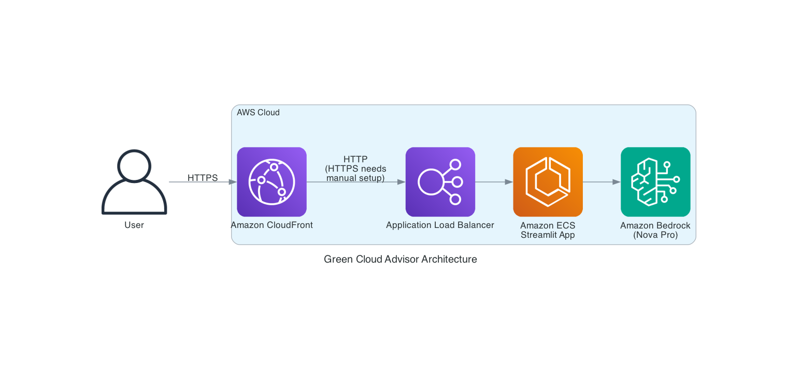

# 🌱 GreenCloud Advisor

GreenCloud Advisor is an AWS Region Sustainability Recommender that balances proximity and environmental impact.
It has two modes: 
- **New workload region and optimization recommender** : Specify in natural language the workload you are planning to launch and select the possible regions based on your latency requirements. 
   Once you do that, it first checks wether all the services are available in the selected regions and if they do, then it tells you which region as the lowest sustainability score.
   It also tells you possible optimization you can do for the services you have chosen.
   At then end, you can download the report in pdf format
- **Analyse the actual carbon foorprint for the existing workloads, get insights and chat with the report**: Upload your [Customer Carbon Footprint Tool](https://docs.aws.amazon.com/awsaccountbilling/latest/aboutv2/what-is-ccft.html) report from the billing console
   You can click on ```Get Insights``` button to get the insights like ```what are the top services that are contributing most on the carbon usage```, ```which regions have the most score``` and so on.
   You can also chat with the report by chatbot on the right. Some of the sample questions you can ask are mentioned in the same tab.

You can test this running the streamlit app locally. If you like it, you can deploy this to your AWS account.

## Contributors
* [Shubham Tiwari](twars@amazon.com)
* [Smita Srivastava](smisriv@amazon.com)
* [Kayalvizhi Kandasamy](kayalvk@amazon.com)
* [Gaurav Gupta](gauravgp@amazon.com)

## Features

- **Smart Region Selection**: Analyzes proximity, service availability, and carbon footprint
- **Dual Carbon Accounting**: Uses both location-based and market-based methods
- **CCFT Integration**: Upload and analyze your AWS Customer Carbon Footprint Tool reports
- **Interactive Web UI**: Streamlit-based interface for easy use

## Solution overview
This solution uses https://app.electricitymaps.com/ apis to get the carbon numbers of a specific region in the world to give a region score for the new workload. You need to create an **API KEY** to use the electricitymaps apis
- create an API Token in https://app.electricitymaps.com/settings/api-access with an account. You can use sandbox key for free.
- Once you do that, save the same in ```API_TOKEN``` parameter in the config ```config``` in the root folder. It should look like this ```API_TOKEN='Xsxxxxxxxxxxxxxxx7```

This solution operates in two modes **Region Analysis** and **CCFT Report Analysis**. For **Region Analysis**, https://app.electricitymaps.com/ is used to get the sustainability score for the region you choose.
Both modes use GenAI to create the recommendations and report.

## Run the app locally
Open a terminal locally
- set AWS credentials in the terminal
- Install the dependencies ``` pip install requirements.txt ```
- run the streamlit app ```streamlit run streamlit_app.py --server.port 8501```
with the above command http://localhost:8501 will be opened. If it is not opened, open the same in a browser

## Deploy the app on AWS
This app can also be deployed on AWS. In the main folder, you would find a cloudformation template to deploy the app to ECS,ALB and CloudFront

   ### Architecture Diagram

   

Prerequisites:
* docker
* python >= 3.8
* use a browser for development

To Deploy:
1. Open a bash terminal and set aws-credentials for the account you want to deploy the solution to.
1. Build a docker image and upload the same to ECR. By default it creates ECR repo in us-east-1 region. Feel free to change to different region. Replace <account-id> with the actual value where you are creating the ECR repository.
   * Create ECR repository: ```aws ecr create-repository --repository-name greencloud --region us-east-1 ```
   * Authenticate Docker to ECR: ```aws ecr get-login-password --region us-east-1 | docker login --username AWS --password-stdin <account-id>.dkr.ecr.us-east-1.amazonaws.com ```
   * Build the docker image: ```docker build -t greencloud .```
   * Tag the docker image: ```docker tag greencloud:latest <account-id>.dkr.ecr.us-east-1.amazonaws.com/greencloud:latest```
   * Push the image to ECR: ```docker push <account-id>.dkr.ecr.us-east-1.amazonaws.com/greencloud:latest```

   Note the above ```container image``` as it is needed for the cloudformation stack below at step 3.

1. Open the ```config``` file and edit the ECR container image path for ```CONTAINER_IMAGE```. It should look something like ```123456789.dkr.ecr.us-east-1.amazonaws.com/greencloud:latest```

1. Run deploy.sh to deploy the cloudformation in your account
```./deploy.sh```

## Usage

### Web Interface for new workload
1. Enter your AWS services or workload description
1. Select potential AWS regions to evaluate
1. Click "Analyze Regions" for recommendations
1. Get a summary about which region is better for sustainability and optimization recommendations. (Download available)

### Web Interface fpr existing workloads using ccft report
1. Upload your CCFT report which you can download from your Billing console. More can be found here: [Customer Carbon Footprint Tool](https://docs.aws.amazon.com/awsaccountbilling/latest/aboutv2/what-is-ccft.html)
1. Get Insights from your CCFT report (Download available)
1. Chat with your CCFT report using Amazon Nova pro

## Important Notes
- The connection between CloudFront and the ALB is in HTTP, not SSL encrypted. This means traffic between CloudFront and the ALB is unencrypted. It is **strongly recommended** to configure HTTPS by bringing your own domain name and SSL/TLS certificate to the ALB.
- The provided code is intended as a demo and starting point, not production ready. The Python app relies on third party libraries like Streamlit and streamlit-cognito-auth. As the developer, it is your responsibility to properly vet, maintain, and test all third party dependencies. The authentication and authorization mechanisms in particular should be thoroughly evaluated. More generally, you should perform security reviews and testing before incorporating this demo code in a production application or with sensitive data.
- AWS provides various services, not implemented in this demo, that can improve the security of this application. Network security services like network ACLs and AWS WAF can control access to resources. You could also use AWS Shield for DDoS protection and Amazon GuardDuty for threats detection. Amazon Inspector performs security assessments. There are many more AWS services and best practices that can enhance security - refer to the AWS Shared Responsibility Model and security best practices guidance for additional recommendations. The developer is responsible for properly implementing and configuring these services to meet their specific security requirements.

## Licence
This application is licensed under the MIT-0 License. See the LICENSE file.

## Cleanup
1. Delete the stack by going to cloudformation
2. Delete the repo in ECR


